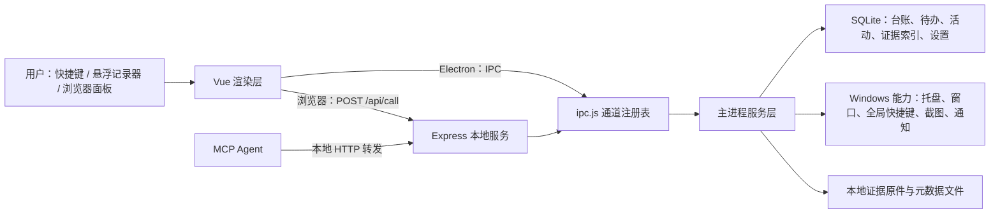

# 牛马联盟项目结构与功能梳理

> 梳理日期：2026-08-26  
> 代码版本：`0.2.2`（见 `package.json`）  
> 范围：当前 `gg` 分支工作区的源码、配置、计划文档与自动化测试。

## 项目是什么

“牛马联盟”是 Windows 优先的本地工作记录桌面应用。它用悬浮记录器和全局快捷键记录工作时间，用 SQLite 保存台账、待办、活动轨迹与证据索引；浏览器面板用于管理、统计和导出。它还提供本地 MCP 服务，供 Agent 操作待办并查询台账/证据。

数据默认存放在用户的 AppData／用户指定证据库中，而非 Git 仓库或云端。

## 文件结构

```text
.
├─ src/
│  ├─ main/                 Electron 主进程：唯一的业务与原生能力入口
│  │  ├─ db/                SQLite 初始化、迁移、各业务仓储
│  │  ├─ services/          台账、活动、证据、待办、提醒、更新等业务服务
│  │  ├─ server/            Express 本地 Web/API 服务
│  │  ├─ index.js           应用生命周期、快捷键、托盘、窗口和服务编排
│  │  ├─ ipc.js             IPC/HTTP 共用的通道注册表
│  │  └─ windows.js         悬浮记录器、标签选择器和提醒窗口
│  ├─ preload/              受控暴露 Electron IPC 给渲染层
│  ├─ renderer/             Vue 3 + Vite 多入口界面
│  │  └─ src/views/         台账、证据、报表、工具、待办、设置、系统页
│  ├─ mcp/server.mjs        标准输入输出 MCP 服务，转发到本地 HTTP API
│  └─ shared/constants.js   IPC 名、事件名、默认配置
├─ tests/                   Vitest：台账/活动/待办/报表与生命周期测试
├─ scripts/                 UTF-8 启动、MCP、发布预检、打包辅助脚本
├─ plan/                    产品设计、实现计划、发行与集成说明
├─ dist/                    Vite 构建出的渲染层产物
├─ build/                   安装器资源
├─ package.json             Electron/Vue/Vite/SQLite 依赖与命令
├─ vite.config.js           面板、记录器、标签选择器、提醒页四个构建入口
└─ electron-builder*.yml    日常与正式发行打包配置
```

## 功能结构与数据流



| 模块 | 主要能力 | 关键实现位置 |
|---|---|---|
| 台账与记录器 | 开始/暂停/继续/完成、切换任务、补记、调时、暂停点拆分与合并 | `src/main/services/ledger.js`、`src/renderer/src/recorder/`、`LedgerView.vue` |
| 活动轨迹 | 采样前台窗口和空闲状态，生成“未记录活动”或“记录内 idle”线索；用户确认后才写入正式台账 | `src/main/services/activity.js` |
| 证据库 | 多屏截图、手动导入、SHA-256、元数据、索引重建、迁移、Markdown 证据链导出 | `src/main/services/evidence.js`、`EvidenceView.vue` |
| 待办 | 状态、优先级、截止日期、关闭/重开、延后与桌面到期提醒 | `src/main/services/todos.js`、`todoReminder.js`、`TodosView.vue` |
| 报表 | 日时间线、标签分布、有效工时、碎片统计、月趋势图 | `src/main/services/report.js`、`ReportView.vue` |
| 设置与系统 | 快捷键、隐私脱敏、证据路径、MCP 配置、备份恢复、诊断与更新 | `SettingsView.vue`、`SystemView.vue`、`lifecycle.js`、`updater.js` |
| MCP | 待办写操作，以及台账/证据的只读查询；调用桌面程序内的本地 API | `src/mcp/server.mjs` |

## 运行方式

1. Electron 主进程启动后初始化生命周期保护和 SQLite，创建托盘、悬浮记录器、全局快捷键，并启动 Express 服务。
2. 四个 Vite 页面（`panel`、`recorder`、`tagpicker`、`reminder`）加载同一套 Vue/JS 代码。
3. Vue 的 `api.js` 在 Electron 内通过 preload 走 IPC；在普通浏览器中走 `POST /api/call`。两条通道最终复用同一组业务 handler。
4. 服务层处理业务规则并写 SQLite；证据原件和 JSON 元数据保留在本地文件系统。主进程再把状态变化推送给 Electron 窗口。

## 数据模型摘要

核心表包括：`tags`、`time_entries`、`pause_points`、`ledger_revisions`、`todos`、`activity_log`、`activity_ignored_suggestions`、`evidence_items`、`evidence_metadata`、`evidence_reviews`、`settings`、`app_metadata`。

其中，`time_entries` 是正式台账的唯一统计来源；`activity_log` 只是原始传感器流水，不会自动计入工时。证据原件不存入 SQLite，数据库只保存其索引与关联信息。这三个边界是理解项目的关键。

## 验证状态

- 已执行 `npm test`：通过，2 个测试文件、42 个测试全部通过。
- 现有自动测试重点覆盖：台账状态机、暂停点拆分/合并、时间重叠校验、待办闭环、报表统计、活动线索裁剪，以及首次安装和数据库降级保护。
- `plan/PROJECT_TODO.md` 仍列有需人工验收的项目，主要集中在多屏截图稳定性、证据导入/预览和活动轨迹的真实使用体验。这些不能因单元测试通过而视为完成。

## 证据 → 结论 → 路径

| 证据 | 结论 | 路径 |
|---|---|---|
| `package.json` 的主入口为 `src/main/index.js`，依赖包含 Electron、Vue、Vite、Express、better-sqlite3 | 项目是本地桌面应用，不是 SaaS 或纯 Web 页面 | `package.json` → `src/main/index.js` |
| `vite.config.js` 声明四个 HTML 入口；渲染层 `api.js` 同时支持 IPC 和 HTTP | 一个 Vue 界面可被 Electron 窗口与浏览器复用 | `vite.config.js` → `src/renderer/src/api.js` |
| `ipc.js` 的通道覆盖 ledger、evidence、todos、report、settings、system；这些通道转发到服务层 | 业务规则集中在主进程，UI 只是调用者 | `src/renderer/` → `src/main/ipc.js` → `src/main/services/` |
| 迁移脚本创建台账、活动、待办、证据、设置和应用元数据等表 | SQLite 是系统记录与配置的事实来源 | `src/main/db/migrations.js` → `src/main/db/index.js` |

## 审视后的建议

1. 设计文档有滞后风险。`plan/DESIGN.md` 仍以 v0.3 的目标结构描述了一些当前已不存在或已演变的路径，而当前代码是 `0.2.2`、四入口页面和 `recorder` 命名。继续按旧设计文档开发容易产生“文档以为有、代码实际没有”的误判；建议把它拆成“已实现架构”和“产品愿景”两份文档。
2. 这里最容易被忽略的产品风险不是功能少，而是“证据”二字的法律预期过高。SHA-256、时间线和本地元数据能提高可追溯性，但不自动等于法律上不可争议的证据链。若产品对外宣传这一能力，应补充清晰的适用边界、导出完整性说明和用户操作留痕策略。
3. 当前工作区有未跟踪的 `output/` 目录。你之后准备推送 `gg` 时，不要图省事执行 `git add .`；先确认该目录是否只是本地构建产物。正式发行配置明确要求二进制产物不进入仓库。

## 建议的下一步

优先做一次面向真实设备的手工回归：多屏 F10 截图、证据导入/迁移、活动线索转台账、备份恢复。它们是当前单元测试最难替代、且最影响用户信任的路径。
