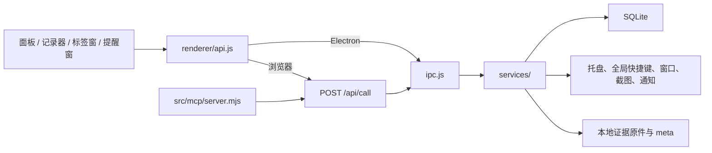

# 牛马联盟当前实现架构

> 更新日期：2026-08-26  
> 适用版本：`package.json` 中的当前版本。  
> 本文是源码结构、运行链路和 UI 改造约束的事实基线；产品愿景见 [DESIGN.md](DESIGN.md)，功能完成度见 [PROJECT_TODO.md](PROJECT_TODO.md)。

## 快速理解

应用的业务逻辑集中在 Electron 主进程。Vue 只负责显示和交互，不能直接访问数据库或文件系统；无论 UI 来自 Electron 窗口还是浏览器，最终都调用同一份 IPC handler 和服务层。



## 当前目录与职责

| 路径 | 职责 |
|---|---|
| `src/main/index.js` | 生命周期、单实例、服务编排、快捷键和托盘动作入口 |
| `src/main/ipc.js` | IPC/HTTP 共用 handler 注册与主进程事件广播 |
| `src/main/services/` | 台账、活动、证据、待办、报表、提醒、设置、升级、备份恢复 |
| `src/main/db/index.js` | SQLite 连接和业务仓储 |
| `src/main/db/migrations.js` | 版本化 schema 迁移 |
| `src/main/server/index.js` | Express 静态站点和 `/api/call` 服务 |
| `src/main/windows.js` | recorder、tagpicker、reminder 窗口生命周期 |
| `src/preload/index.js` | 受控暴露 `window.niuma` |
| `src/renderer/` | Vite 四入口 UI：`panel.html`、`recorder.html`、`tagpicker.html`、`reminder.html` |
| `src/renderer/src/views/` | 主面板：台账、证据、报表、工具、待办、设置、系统、首次引导 |
| `src/mcp/server.mjs` | MCP 待办写入与台账/证据查询的本地转发 |
| `src/shared/constants.js` | IPC 名、事件名和默认设置 |

## 当前 UI 入口

| 界面 | 入口 | 主要职责 |
|---|---|---|
| 主面板 | `panel.html` → `src/renderer/src/App.vue` | 台账、证据、报表、工具、待办、设置、系统 |
| 悬浮记录器 | `recorder.html` → `src/renderer/src/recorder/recorder.js` | 最短路径的开始、暂停、停止、标签选择 |
| 标签选择窗 | `tagpicker.html` → `src/renderer/src/tagpicker/tagpicker.js` | 当前记录归类 |
| 提醒窗 | `reminder.html` → `src/renderer/src/reminder/reminder.js` | 提醒与快捷操作 |

## UI 改造护栏

1. **不改业务边界。** UI 只能通过 `renderer/src/api.js` 调用；禁止在 Vue 组件中直接读写 SQLite、证据目录或 Electron 原生 API。
2. **不随意改 IPC 名或返回结构。** `src/shared/constants.js` 与 `src/main/ipc.js` 同时服务桌面 UI、浏览器 UI 和 MCP。视觉升级若改接口，必须同时回归这三类调用方。
3. **四入口分别验收。** 主面板、悬浮记录器、标签选择窗、提醒窗不是同一个页面的缩放版；改动公共样式或交互时必须逐一检查。
4. **双宿主验收。** Electron 可以接收主进程推送事件；普通浏览器的 `api.js` 不订阅这些事件。因此任何“实时刷新”设计都必须定义浏览器侧的刷新策略，不能只在桌面窗口里看起来正常。
5. **台账事实不可由 UI 推断。** 正式工时来自 `time_entries`；活动轨迹只是一种待确认线索。视觉上应持续区分两者，不能把线索默认染成已确认工作。
6. **证据操作需显式确认。** 截图、导入、迁移、删除和导出会影响用户留存材料；UI 升级不能为了“少一步”而取消必要的确认、路径展示和错误反馈。

## 改造前后的文档同步规则

| 变更类型 | 必须更新 |
|---|---|
| 新功能、交互目标、产品取舍 | `DESIGN.md`、`PROJECT_TODO.md` |
| 新页面、入口、IPC、服务或数据结构 | 本文和相应源码注释/测试 |
| 可发布状态、人工验收结果 | `PROJECT_TODO.md`、`RELEASE_LIFECYCLE.md` |

## 变更前最小检查

```powershell
npm test
npm run build:renderer
```

如改动包含窗口、快捷键、截图、浏览器访问或证据迁移，还必须按 [PROJECT_TODO.md](PROJECT_TODO.md) 的手工清单在 Windows 真机验证。
